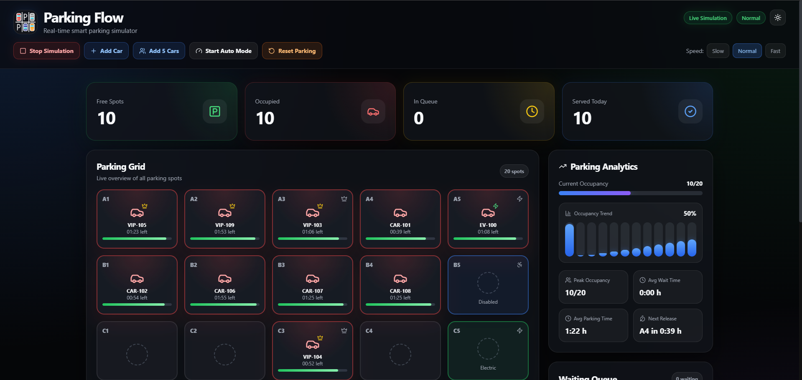
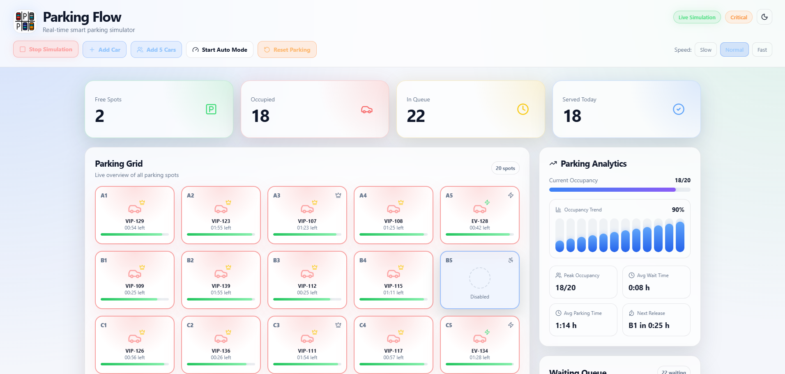
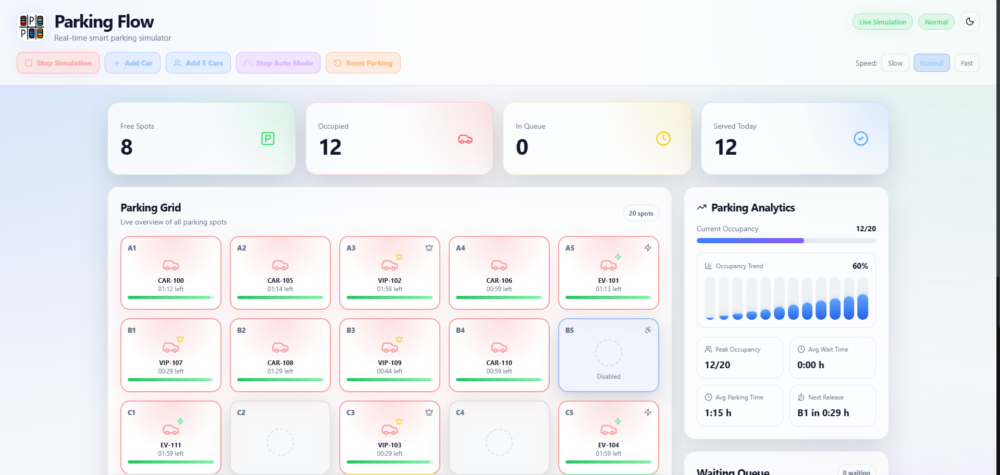
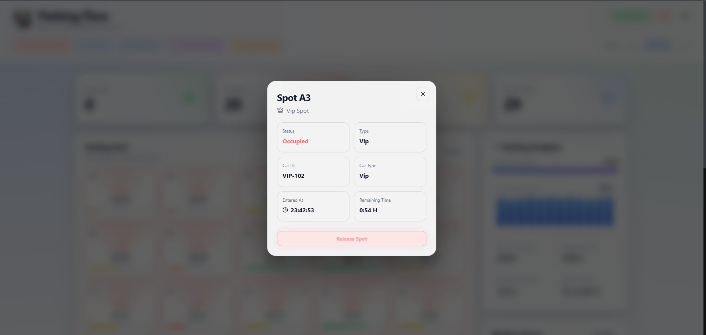
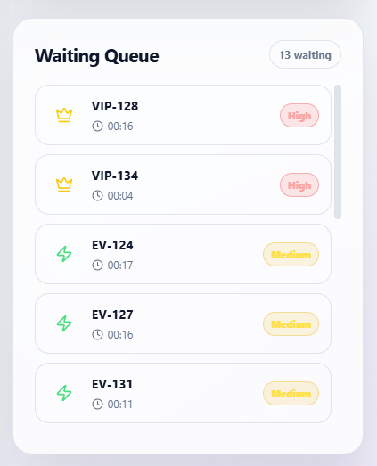

# 🅿️ Parking Flow

<p align="center">
  <strong>Real-time smart parking simulation dashboard built with ASP.NET Core, SignalR and React.</strong>
</p>

<p align="center">
  
  
  
  
  
  
</p>

<p align="center">
   
</p>

---

## 📚 Table of Contents

- [Overview](#overview)
- [Features](#features)
- [Concurrency Requirements](#concurrency-requirements)
- [Screenshots](#screenshots)
- [Tech Stack](#tech-stack)
- [Requirements](#requirements)
- [Getting Started](#getting-started)
- [Project Structure](#project-structure)
- [Future Improvements](#future-improvements)
- [Author](#author)

---

<a id="overview"></a>
## 📌 Overview

**Parking Flow** is a real-time smart parking simulator created as a university project for **ASP.NET application programming**.

The application simulates cars entering, waiting, parking and leaving a parking lot.  
The backend is built with **ASP.NET Core Web API** and contains the main simulation logic, including thread synchronization and background task processing.

The frontend is built with **React** and works as a live dashboard. It displays the current parking state, queue, activity log, statistics, occupancy trend and detailed information about each parking spot.

The main goal of the project was to demonstrate practical use of:

- thread synchronization,
- semaphores,
- thread pool tasks,
- AJAX communication,
- WebSocket live updates.

---

<a id="features"></a>
## ✨ Features

### 🅿️ Parking Simulation

- 20 parking spots
- live parking spot status
- cars entering and leaving the parking lot
- waiting queue for cars
- automatic and manual simulation mode
- manual spot release
- parking reset option

### 🚗 Car Types

The simulation supports different car types:

- normal car
- electric car
- VIP car

Cars can be assigned to preferred parking spots depending on their type.

### 🅿️ Parking Spot Types

The parking grid includes several types of parking spots:

- Standard
- VIP
- Electric
- Disabled
- Reserved

Each type is visually marked in the frontend.

### 📊 Dashboard Analytics

The dashboard displays:

- free spots
- occupied spots
- cars in queue
- served cars
- current occupancy
- peak occupancy
- average wait time
- average parking time
- next spot release
- occupancy trend chart

### 🧾 Activity Log

The application includes a live activity log with event types:

- entered
- left
- waiting
- full
- system

Each event is updated in real time and displayed with a timestamp.

### 🌗 UI Modes

The frontend supports:

- dark mode
- light mode
- dynamic logo depending on selected theme
- premium graphite glassmorphism style
- responsive dashboard layout

---

<a id="concurrency-requirements"></a>
## 🧵 Concurrency Requirements

The project uses several mechanisms required by the laboratory assignment.

| Requirement | Implementation |
|---|---|
| Lock / Mutex | `lock` protects parking spots, queue, activity log and simulation state |
| Semaphore | `SemaphoreSlim` controls the number of available parking spaces |
| Thread Pool | each car is processed as a separate `Task.Run()` background task |
| AJAX | frontend actions use `fetch()` to call ASP.NET Core API endpoints |
| WebSocket | SignalR sends live parking updates from backend to frontend |

### Lock

The backend uses `lock` to protect shared application state, including:

- parking spot list,
- waiting queue,
- activity log,
- simulation status.

### SemaphoreSlim

The parking lot has a limited number of spaces.  
`SemaphoreSlim` controls whether a car can enter the parking lot or must wait in the queue.

### Task.Run

Each car is handled as a separate background task.  
A car can wait for a place, enter the parking lot, stay for a randomly selected parking time and then leave.

### AJAX / fetch

The React frontend communicates with ASP.NET Core API endpoints using `fetch()`.

Main actions:

- add car,
- add five cars,
- start simulation,
- stop simulation,
- start auto mode,
- stop auto mode,
- release parking spot,
- reset parking.

### SignalR / WebSocket

SignalR is used to update the frontend live after every change in the parking state.

The frontend receives:

- parking spot updates,
- queue updates,
- statistics updates,
- activity log updates.

---

<a id="screenshots"></a>
## 📸 Screenshots

### Dashboard

| Dark Mode | Light Mode |
|---|---|
|  |  |

### Parking View

| Parking Grid | Spot Details |
|---|---|
|  |  |

### Queue

| Waiting Queue |
|---|
|  |

---

<a id="tech-stack"></a>
## 🛠️ Tech Stack

| Area | Technology |
|---|---|
| Backend | ASP.NET Core Web API |
| Backend language | C# |
| Real-time communication | SignalR / WebSocket |
| Synchronization | lock, SemaphoreSlim |
| Background processing | Task.Run, ThreadPool |
| Frontend | React |
| Frontend build tool | Vite |
| API communication | fetch / AJAX |
| Icons | Lucide React |
| Animations | Framer Motion |
| Styling | CSS, glassmorphism, responsive layout |

---

<a id="requirements"></a>
## ⚙️ Requirements

To run the project locally, you need:

- .NET 8 or newer
- Node.js 18 or newer
- npm
- Visual Studio 2022 or Visual Studio Code
- modern web browser

---

<a id="getting-started"></a>
## 🚀 Getting Started

### 1. Clone the repository

```bash
git clone https://github.com/your-username/ParkingFlow.git
cd ParkingFlow
```

### 2. Run the backend

```bash
cd backend/ParkingFlow.Api
dotnet run
```

The backend should start on addresses similar to:

```text
https://localhost:7246
http://localhost:5288
```

Swagger is available at:

```text
https://localhost:7246/swagger
```

Main API endpoint:

```http
GET http://localhost:5288/api/parking/state
```

SignalR hub:

```text
http://localhost:5288/parkingHub
```

### 3. Run the frontend

Open a second terminal:

```bash
cd frontend
npm install
npm run dev
```

The frontend should be available at:

```text
http://localhost:5173
```

---

<a id="project-structure"></a>
## 📁 Project Structure

```text
ParkingFlow/
├── backend/
│   └── ParkingFlow.Api/
│       ├── Controllers/
│       │   └── ParkingController.cs
│       ├── Hubs/
│       │   └── ParkingHub.cs
│       ├── Models/
│       │   ├── ParkingCar.cs
│       │   ├── ParkingEvent.cs
│       │   ├── ParkingSpot.cs
│       │   ├── ParkingState.cs
│       │   └── ParkingStats.cs
│       ├── Services/
│       │   └── ParkingService.cs
│       ├── appsettings.json
│       └── Program.cs
│
├── frontend/
│   ├── public/
│   │   ├── favicon.svg
│   │   ├── spaces-darkmode.png
│   │   └── spaces-lightmode.png
│   ├── src/
│   │   ├── components/
│   │   │   ├── ActivityLog.jsx
│   │   │   ├── AnalyticsPanel.jsx
│   │   │   ├── Header.jsx
│   │   │   ├── ParkingGrid.jsx
│   │   │   ├── ParkingSpot.jsx
│   │   │   ├── SpotDetailsModal.jsx
│   │   │   ├── StatCard.jsx
│   │   │   └── WaitingQueue.jsx
│   │   ├── services/
│   │   │   └── parkingApi.js
│   │   ├── App.css
│   │   ├── App.jsx
│   │   ├── index.css
│   │   └── main.jsx
│   ├── package.json
│   └── vite.config.js
│
├── screenshots/
│   ├── darkmode.png
│   ├── lightmode.png
│   ├── place.png
│   ├── ss1.png
│   └── waitingqueue.png
│
├── .gitignore
├── LICENSE
└── README.md
```
---

<a id="future-improvements"></a>
## 🚧 Future Improvements

- add user accounts
- add parking payment simulation
- add database support for historical results
- add charts for long-term occupancy statistics
- add more detailed car priority rules
- add admin panel for parking spot configuration
- add deployment configuration
- add automated backend tests
- add Docker support

---

<a id="author"></a>

## 👩‍💻 Author

Created by Katarzyna Stańczyk.
